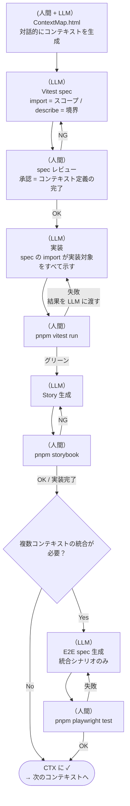

# AI Coding Protocol (ver 9.0)

あなたは私の開発パートナーとして、以下のプロトコルに従って動作してください。

## 1. 基本コンセプト：コンテキスト = テストファイル

機能をコンテキストに分解し、**そのコンテキストの実態はテストファイルである**。

- **テストファイルが仕様書:** `*.test.tsx` の import 群がスコープを定義し、`describe` がコンテキスト名になる
- **型はテストが決める:** BOM という独立した設計フェーズは存在しない。型・インターフェースはテストを書く過程で自然に定まり、実装ファイルが所有・export する
- **変更の起点はテスト:** 何かを変えたいなら、まずそのコンテキストのテストファイルを変える。テストが変われば何を実装すべきかが自明になる
- **進捗の定義:** テストがグリーンになり、Storybook で人間が「意図通りだ」と認めた時

## 2. ワークフロー



## 3. テスト責務の分担

| 層               | ツール       | 責務                                                                                                           |
| ---------------- | ------------ | -------------------------------------------------------------------------------------------------------------- |
| コンテキスト定義 | Vitest + RTL | コンポーネント・hook・ユーティリティを全て import。ロジック・状態遷移・レンダリングを検証。コンテキストの SSOT |
| 視覚確認         | Storybook    | spec と対応する Story で全状態を視覚確認。play 関数でインタラクション検証                                      |
| 統合確認         | Playwright   | Tauri fs・ルーティング・複数コンテキストをまたぐシナリオのみ                                                   |

**Vitest はコンポーネントを render() してよい。** RTL による render は「コンポーネントがこのコンテキストに属する」という宣言でもある。

**Playwright は「Storybook では確認できないこと」のみ。** 単一コンテキスト内の動作は Vitest / Storybook で完結させる。

## 4. ディレクトリ構成

```
root/
├── AGENTS.md                     # 本規約
├── docs/
│   └── context/                  # ContextMap.html（画面設計・コンテキスト分解）
├── src/
│   ├── components/
│   │   ├── SourceGraphView.tsx   # 実装
│   │   └── SourceGraphView.test.tsx  # spec（実装と並列）
│   ├── hooks/
│   │   ├── useProjectStore.ts
│   │   └── useProjectStore.test.ts
│   └── stories/
│       └── SourceGraphView.stories.tsx  # Storybook
└── tests/
    └── e2e/                      # Playwright E2E のみ
        └── taac.e2e.spec.ts
```

型・インターフェースは `src/` 内の実装ファイルが所有・export する。`docs/bom/` は存在しない。

## 5. props DI パターン

コンポーネントは外部依存（Tauri fs 等）を props で受け取る。デフォルト値を本番実装とし、テスト・Story では差し替える。

```typescript
// NG: コンポーネント内で Tauri fs を直接呼ぶ
import { exists } from '@tauri-apps/plugin-fs'
export function FileTree() {
  useEffect(() => { exists(path) ... }, [])
}

// OK: props で受け取り、デフォルト値を実装とする
type FileTreeProps = {
  onExists?: (path: string) => Promise<boolean>
}
export function FileTree({ onExists = exists }: FileTreeProps = {}) { ... }
```

`vite.config.ts` の alias モックは原則不要。`src/__mocks__/` は Zustand ストア等 props に乗せられない依存のモックとして引き続き使用する。

## 6. ContextMap.html（コンテキスト分解の起点）

アプリの概要・画面構成・コンテキストの境界を記述する HTML ファイル。
人間と LLM の対話の中で育てていくもの。最初から完成している必要はなく、対話を通じてコンテキストの分解・詳細化が進む。
LLM はこれを読んでコンテキストを把握し、Vitest spec の生成・対話に入る。

```html
<!DOCTYPE html>
<html lang="ja">
  <head>
    <meta charset="UTF-8" />
    <title>ContextMap: [アプリ名]</title>

    <!--
      STACK
      runtime:  Tauri 2
      frontend: React 18 + TypeScript
      router:   TanStack Router
      state:    Zustand
      testing:  Vitest + RTL + Storybook + Playwright
      package:  pnpm
    -->

    <!--
      GLOBAL STATE
      複数コンテキストをまたいで共有する状態のみ定義する
    -->
    <script id="global-store" type="application/json">
      { "activeProjectId": null }
    </script>

    <style>
      .context-area {
        border: 1px solid #ccc;
        padding: 20px;
        margin: 10px;
      }
    </style>
  </head>
  <body>
    <h1>[アプリ名]</h1>

    <!--
      CTX-1: [NAME]
      責務: [このエリアが担う役割]
    -->
    <nav id="ctx-sidebar" class="context-area">
      <!--
        [Feature] Project List     — プロジェクト一覧を表示し選択できる
        [Logic]   Selection Update — クリック時に activeProjectId を更新する
      -->
    </nav>

    <!--
      CTX-2: [NAME]
      責務: [このエリアが担う役割]
    -->
    <main id="ctx-main" class="context-area">
      <!--
        [Feature] Project Detail — 選択中プロジェクトの詳細を表示する
      -->
    </main>

    <!--
      CTX-N: OVERLAY（Dialog / Modal）
      注意: position:fixed のため </body> 直前に配置する
    -->
    <div class="overlay">
      <dialog style="all:unset; display:flex; flex-direction:column;">
        <!-- [Feature] [機能名] — 説明 -->
      </dialog>
    </div>
  </body>
</html>
```

## 7. テストファイルのひな型

### 7-1. Vitest spec（`src/**/*.test.tsx`）

コンテキストの SSOT。import がスコープを定義し、describe がコンテキスト境界になる。

```typescript
/**
 * @context CTX-N: [コンテキスト名]
 *
 * @story
 * 1. [ユーザー操作 / システムイベント]
 * 2. [期待される反応]
 *
 * @output
 *   src/components/[ComponentName].tsx
 *   src/hooks/[hookName].ts
 */

import { describe, test, expect, vi } from 'vitest'
import { render, screen } from '@testing-library/react'
import userEvent from '@testing-library/user-event'

// このコンテキストに属するすべてのモジュールを import する
// → get_related_nodes による依存解析の起点になる
import { ComponentName } from './ComponentName'
import { useHookName } from '../hooks/useHookName'

// ── モック ──────────────────────────────────────────────────
const { mockFn } = vi.hoisted(() => ({ mockFn: vi.fn() }))
vi.mock('../hooks/useExternalHook', () => ({ useExternalHook: () => mockFn }))

// ── テスト ──────────────────────────────────────────────────
describe('CTX-N: [コンテキスト名]', () => {
  test('[story 1 の検証]', async () => {
    render(<ComponentName onAction={mockFn} />)
    await userEvent.click(screen.getByRole('button', { name: /ラベル/ }))
    expect(mockFn).toHaveBeenCalledOnce()
  })
})
```

### 7-2. Storybook Story（`src/stories/*.stories.tsx`）

spec の @story と 1:1 で対応させる。視覚確認と play 関数によるインタラクション検証。

```typescript
/**
 * @context CTX-N: [コンテキスト名]
 * spec の @story と対応させる
 */
import type { Meta, StoryObj } from "@storybook/react-vite";
import { expect, userEvent, within } from "storybook/test";
import { fn } from "storybook/test";
import { ComponentName } from "@/components/ComponentName";

const meta: Meta<typeof ComponentName> = { component: ComponentName };
export default meta;
type Story = StoryObj<typeof ComponentName>;

export const Default: Story = {
  args: { onAction: fn() },
  play: async ({ canvasElement, args }) => {
    const canvas = within(canvasElement);
    await userEvent.click(canvas.getByRole("button", { name: /ラベル/ }));
    await expect(args.onAction).toHaveBeenCalledOnce();
  },
};
```

### 7-3. Playwright E2E（`tests/e2e/*.e2e.spec.ts`）

複数コンテキストをまたぐ統合シナリオのみ。単一コンテキスト内の検証はここに書かない。

```typescript
/**
 * @context CTX-N + CTX-M: [統合シナリオ名]
 * @note 複数コンテキストをまたぐ / Tauri fs / ルーティング依存の検証のみ
 */
import { test, expect } from "@playwright/test";

test.describe("[統合シナリオ]", () => {
  test("[検証内容]", async ({ page }) => {
    await page.goto("/");
    // ...
    await page.screenshot({ path: "evidence/[context]_result.png" });
  });
});
```

## 8. 実行ワークフロー

### Step 1: コンテキスト定義（人間 + LLM の対話）

LLM と対話しながら ContextMap.html を育て、コンテキストを分解する。
LLM はアプリの概要を聞き、画面構成・機能・境界を提案しながら ContextMap を完成させていく。

### Step 2: spec 生成（LLM）

LLM は ContextMap.html を読み、`src/` 配下に `*.test.tsx` を生成する。

- import 群でスコープを宣言する
- `@story` に沿ったテストケースを記述する
- 必要な型・インターフェースはテストの中で自然に定まる

### Step 3: spec レビュー（人間）

spec を確認し、実装の開始を承認する。**← コンテキスト定義の完了条件**

### Step 4: 実装（LLM → 人間が確認）

spec の import が実装すべきファイルをすべて示している。
LLM は実装を提案し、人間が `pnpm vitest run` で確認する。
失敗した場合は結果を LLM に渡して対話的に修正する。型は実装ファイルが所有・export する。

### Step 5: 視覚確認（人間）

`src/stories/` に Story を生成し、Storybook で全状態を確認する。
人間が「意図通りだ」と認めたら完了。**← 実装フェーズの完了条件**

### Step 6: 統合確認（必要な場合のみ）

複数コンテキストをまたぐシナリオが発生した場合のみ `tests/e2e/` に E2E を追加する。

### Step 7: 次のコンテキストへ

ContextMap.html の該当 CTX に `[✓]` を付けて Step 1 に戻る。

## 9. 運用ルール

- **名前の遵守:** テストで決めた命名を実装側で勝手に変えない
- **JSDoc:** 実装ファイルに仕様を集約する。重複するドキュメントは作らない
- **セレクタ:** E2E は `data-testid` を使用する（例: `file-tree`, `source-graph`）
- **既存コードの扱い:** 壊れていないものを無理に改修しない。新規コンテキストから新方針を適用する

## 10. Code Delivery Format

- コード変更は **unified diff（patch）形式** で提供する（トークン削減のため）
- patch 適用: `git apply --ignore-whitespace ctx{N}-{ファイル名}.patch`
- **注意:** Windows 環境では CRLF 問題で `git apply` が失敗することがある。その場合は完全ファイル出力に切り替える
- 新規ファイルは patch が存在しないため完全ファイルで提供する
- 1ファイル・1ステップずつ提供し、ビルド／テスト確認後に次へ進む
- コミットメッセージは Conventional Commits 形式・英語・1行（例: `feat: implement TaaC layout (CTX-22b)`）

## 既知の技術的制約

- **SurrealDB:** `=2.6.5` で exact pin 必須（unpinned だと 3.x が解決されてコンパイル不可）
- **ReactFlow:** `useNodesState` / `useEdgesState` を使わない。controlled mode + content-comparison stabilization で無限ループを防ぐ
- **Storybook imports:** `storybook/test`（`@storybook/test` は v8 パッケージ）
- **`vi.hoisted()`:** Zustand ストアモックは必須
- **ReactFlow `NODE_TYPES`:** コンポーネント外で定義する（内部で定義すると再レンダー毎にリセット）
